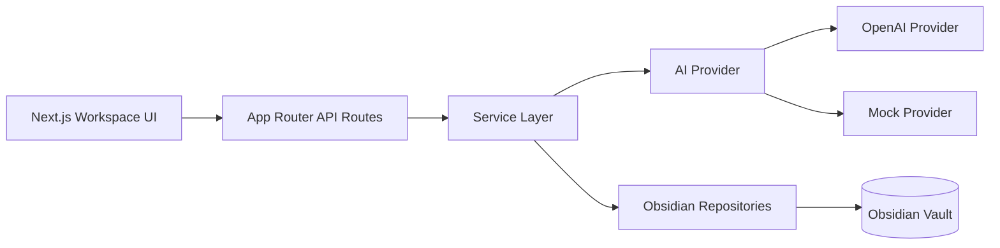
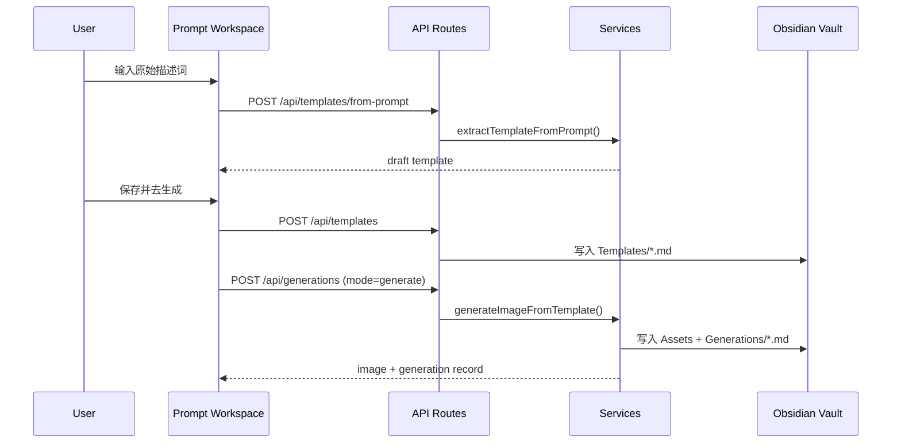

# Vision Text Bridge MVP

一个中文优先的 Prompt 模板工作台。它支持从图片或描述词抽取可复用模板，填充槽位生成图片，并把模板与生成记录归档到 Obsidian Vault。

## 本地启动

1. 安装依赖

```bash
pnpm install
```

2. 配置环境变量

```bash
export OPENAI_API_KEY="sk-..."
export VISION_TEXT_BRIDGE_VAULT_DIR="/absolute/path/to/your/obsidian-vault"
```

可选变量：

- `OPENAI_TEMPLATE_MODEL`
- `OPENAI_IMAGE_MODEL`
- `OBSIDIAN_VAULT_DIR`

如果未设置 `OPENAI_API_KEY`，应用会自动退回到本地 mock provider，便于本地开发、E2E 测试和演示。

### 使用本机 Codex 抽取模板

如果你没有配置 `OPENAI_API_KEY`，但本机已经安装并登录了 `codex`，可以切到本机模式试用模板抽取：

```bash
export AI_PROVIDER_MODE="codex-chatgpt-web"
export CODEX_TEMPLATE_MODEL="gpt-5.3-codex"
export VISION_TEXT_BRIDGE_VAULT_DIR="/absolute/path/to/your/obsidian-vault"
```

或者直接在项目根目录使用 `.env`：

```dotenv
AI_PROVIDER_MODE=codex-chatgpt-web
CODEX_TEMPLATE_MODEL=gpt-5.3-codex
VISION_TEXT_BRIDGE_VAULT_DIR=/absolute/path/to/your/obsidian-vault
```

当前这条链路只适合试用：

- `描述词生成模板`
- `图片生成模板`

当前还不建议试用 `模板生成图片`，因为 ChatGPT 网页自动出图 provider 仍在实现中。

3. 启动开发服务

```bash
pnpm dev
```

4. 打开浏览器

- `http://127.0.0.1:3000/`

## 常用命令

```bash
pnpm test
pnpm test:e2e
pnpm build
```

## MVP 功能

- 图片生成模板：上传参考图，抽取模板、槽位、风格标签和负面词
- 描述词生成模板：把原始提示词整理成可复用模板
- 模板生成图片：填写槽位并生成结果，自动保存生成记录
- 模板库：查看已保存模板
- 生成记录：查看历史生成结果
- 设置：查看当前 Vault、Provider、Model 配置

## 环境变量说明

| 变量名 | 说明 | 必填 |
| --- | --- | --- |
| `OPENAI_API_KEY` | OpenAI API Key；缺失时自动使用 mock provider | 否 |
| `AI_PROVIDER_MODE` | Provider 模式；试用本机 Codex 时设为 `codex-chatgpt-web` | 否 |
| `CODEX_TEMPLATE_MODEL` | Codex 模板抽取模型，默认 `gpt-5.3-codex` | 否 |
| `VISION_TEXT_BRIDGE_VAULT_DIR` | Obsidian Vault 根目录 | 否 |
| `OBSIDIAN_VAULT_DIR` | Vault 根目录的兼容别名 | 否 |
| `OPENAI_TEMPLATE_MODEL` | 模板抽取模型，默认 `gpt-4.1-mini` | 否 |
| `OPENAI_IMAGE_MODEL` | 出图模型，默认 `gpt-image-1` | 否 |

## Obsidian 目录布局

```text
<vault>/
├── Templates/
├── Generations/
│   └── <topic>/
├── Assets/
│   └── generated/
│       └── <topic>/
└── Settings/
    └── vision-text-bridge.md
```

## 使用流程

1. 进入 `描述词生成模板` 或 `图片生成模板`
2. 抽取模板并检查槽位、模板文本、负面词
3. 点击 `保存并去生成`
4. 在 `模板生成图片` 填写槽位
5. 点击 `开始生成`
6. 查看右侧结果，并确认生成记录已归档

## 系统结构图



## 端到端主流程



## 主要页面

- `/`
- `/image-template`
- `/prompt-template`
- `/generate`
- `/templates`
- `/generations`
- `/settings`

## 当前实现说明

- 开发和测试默认走 mock provider，无需真实 OpenAI key
- 配置 `OPENAI_API_KEY` 后，模板抽取和出图会自动切换到 OpenAI provider
- 生成记录会写入 Markdown，生成图片会写入 Vault 下的 `Assets/generated/<topic>/`
